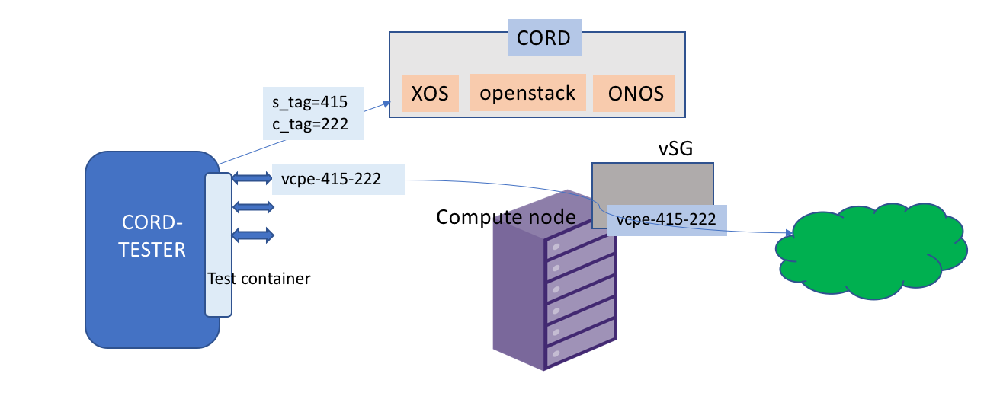

# Testing CORD

CORD Tester is an automation framework that has been developed to test CORD. The
framework currently includes extensions to test R-CORD. Few framework
modules have been developed to test M-CORD and E-CORD basic tests.

CORD Tester framework is typically deployed as one or more Docker containers, either on
the CORD POD or adjacent to the POD and interacts with the POD through the interfaces.
The Cord-Tester container is deployed as a docker container, residing on the headnode
of the POD. It is brought up with double vlan tagged interfaces (s-tags and c-tags of
subscriber's traffic) to conduct dataplane traffic testing. The following reference
diagram gives a brief overview of how the test container interacts with the POD.

The framework is modular, making it easy to test all the components
that make up CORD. It supports both end-to-end tests and
functional tests of individual components.
The suite of tests is constantly evolving with more features and tests.

Few links below provide detailed information of System Test Guide, Test Plans
and Test Results.

* [System Test Guide](https://wiki.opencord.org/display/CORD/System+Test+Guide)
* [System Test Plans](https://wiki.opencord.org/display/CORD/System+Test+Plans)
* [System Test Results](https://wiki.opencord.org/display/CORD/System+Test+Results)

Additional information about the CORD Tester framework can be found
on the GitHub:

* [Prerequisites](https://github.com/opencord/cord-tester/blob/master/src/test/setup/prerequisites.sh)

* [Source Code](https://github.com/opencord/cord-tester)
