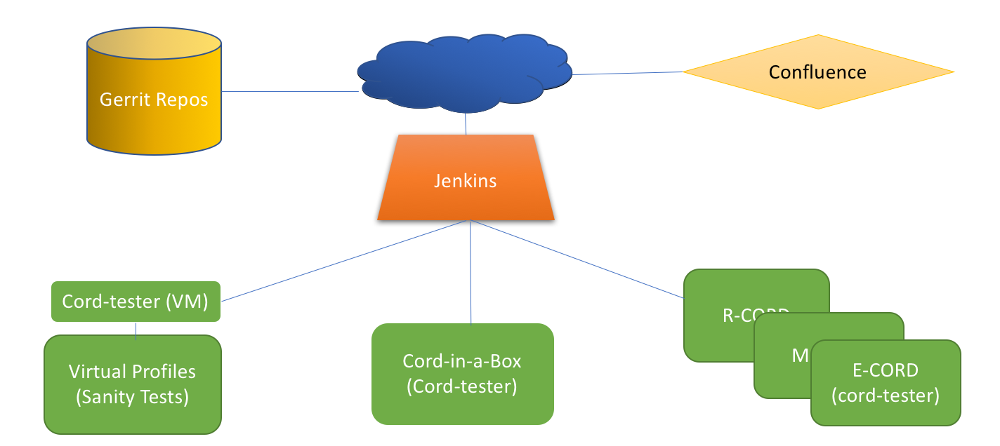

# CORD TEST ENIVRONMENT

Several jenkins based jobs are created to run tests on the following platforms
* Cord-in-a-Box
* Physical POD
* VMs
## Jenkins Test Setup
The following diagram shows how the test servers are interconnected

## Jenkins Integration with Physical POD

