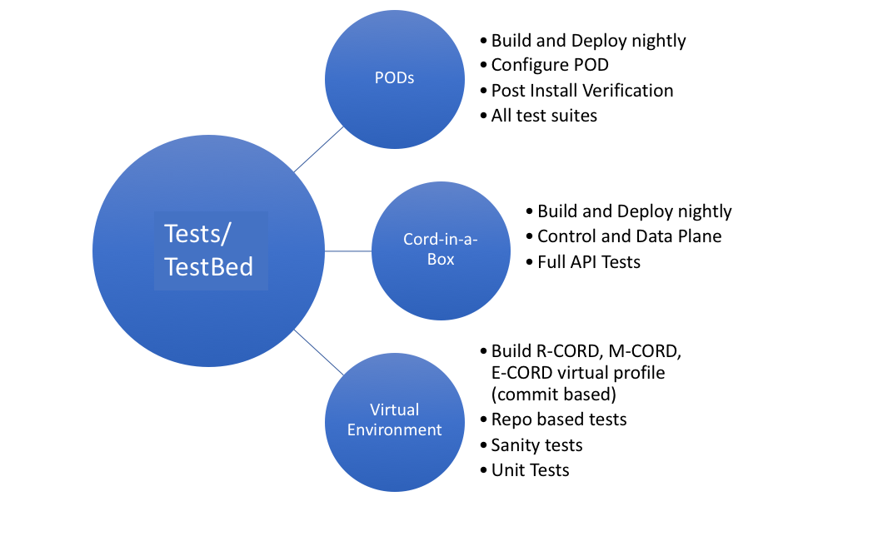

# CORD Test Environment

Several jenkins based jobs are created to run tests on the following platforms
* Physical POD
* Virtual POD(Cord-in-a-Box)
* VMs

## Test Beds
Following picture below describes various test environments that are used to setup CORD and a brief overview on the type of tests that are performed on that test bed.

## Jenkins Test Setup

The following diagram shows how the test servers are interconnected

* To view results from recent runs of the jenkins jobs, please view the [Jenkins dashboard](https://jenkins.opencord.org/)

## Jenkins Integration with Physical POD

The following diagram shows how Jenkins interconnects with a Physical POD.

