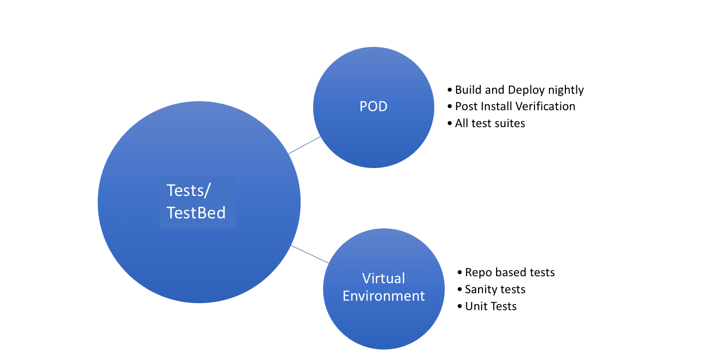
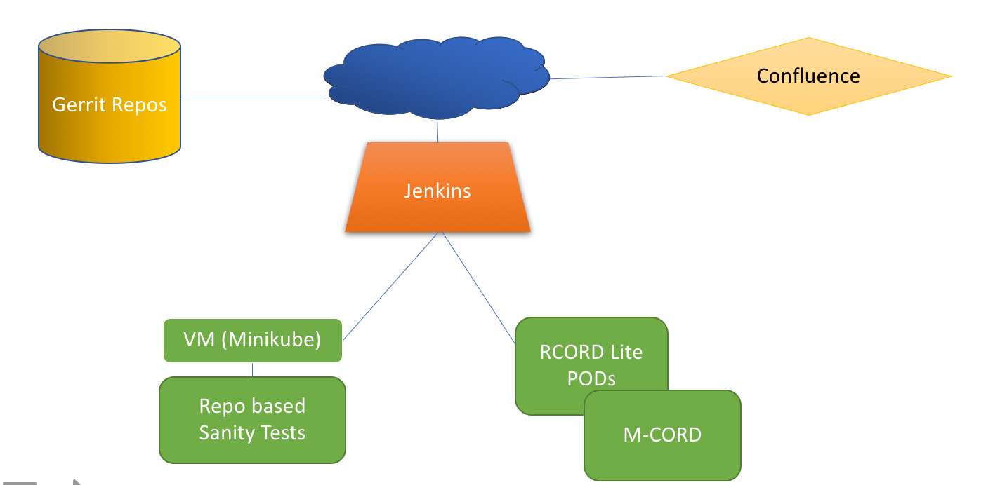

# CORD Test Environment

Several jenkins based jobs are created to run tests on the following platforms

* Physical POD

* VMs 

## Test Beds

Following picture below describes various test environments that are used to
setup CORD and a brief overview on the type of tests that are performed on that
test bed.

## Jenkins Test Setup

The following diagram shows how the test servers are interconnected

* To view results from recent runs of the jenkins jobs, please view the
  [Jenkins dashboard](https://jenkins-new.opencord.org/)
